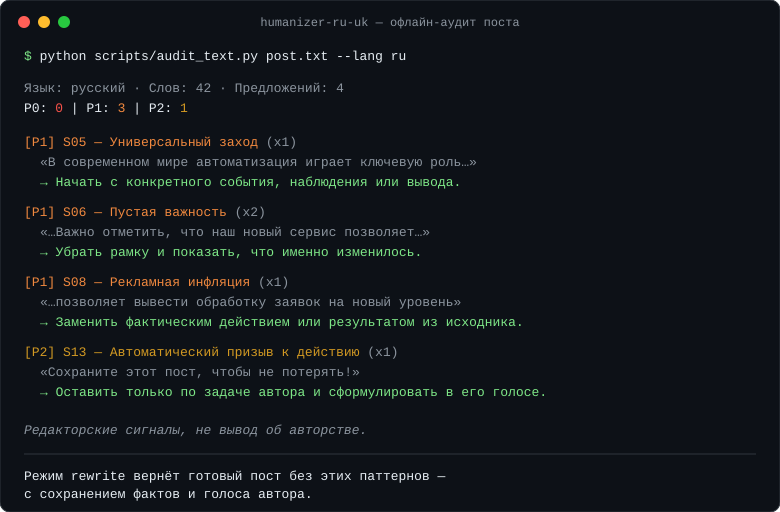

# Humanizer RU/UK

Прибирає ШІ-стиль із дописів українською та російською. Зберігає факти, голос, цифри — нічого не вигадує.

[](CHANGELOG.md) [](LICENSE) [](https://github.com/arhappy777/humanizer-ru-uk/actions/workflows/test.yml)

Автор і мейнтейнер: [Артем (Artem, @arhappy777)](https://github.com/arhappy777).

[README російською](README.md)

---

**Єдиний скіл з українською підтримкою і факт-замком.** Скіл фіксує числа, дати, імена, цитати до правки й не змінює їх. Він не додає від вашого імені досвід, клієнтів або емоції, яких не було в оригіналі.

Якщо ви шукаєте «обхід детекторів» — цей скіл не для вас. Якщо хочете текст, об який не спотикається читач, — він саме тут.

---

## Короткий приклад

До:

```text
У сучасному світі Telegram відіграє ключову роль у комунікації. Варто зазначити, що якісний контент дозволяє вивести канал на новий рівень. Це не просто тексти — це потужний інструмент взаємодії з аудиторією.
```

Після:

```text
У Telegram замало просто публікувати дописи. Якщо перший абзац пасує будь-якому каналу, а далі йдуть однакові списки, читач помічає шаблон раніше за зміст. Нормальний допис починається з того, що автор справді хоче сказати.
```

У прикладі немає випадкового сленгу, помилок чи вигаданої особистої історії. Змінилися конкретні шаблонні місця.

---

## Навіщо він потрібен

Це не інструмент для «обходу детекторів». Його мета — прибрати те, що заважає читачеві: канцелярит, однакові абзаци, порожні гачки, удавану експертність, кальки та механічне оформлення.

На відміну від humanizer-ru та аналогічних інструментів: скіл редагує українську й російську окремо з відповідними каталогами паттернів, не обіцяє обхід детекторів і не додає вигадані деталі.

Скіл:

- єдиний з українською підтримкою: окремий каталог калек, звірення зі стандартом «Українського правопису 2026»;
- окремо редагує українську й російську, не змішуючи їх в один словник;
- знаходить поширені кальки: `приймати участь`, `являється`, `заключається в`, `на даний момент` та інші;
- зберігає числа, дати, імена, посилання, ступінь упевненості й реальні слова автора;
- не вигадує від першої особи досвід, клієнтів, емоції або результати;
- налаштовується під голос автора за 2–5 його текстами;
- адаптує форму під Telegram та Instagram;
- проводить аудит без переписування;
- має офлайн-сканер без API, телеметрії та зовнішніх залежностей.

Це редактор, а не детектор авторства. Він не видає вердикт AI/Human, відсоток «людяності» й не обіцяє обхід систем виявлення.

---

## Встановлення

```bash
# Claude Code (macOS / Linux)
git clone https://github.com/arhappy777/humanizer-ru-uk ~/.claude/skills/humanizer-ru-uk
```

<details>
<summary>Windows (PowerShell)</summary>

```powershell
git clone https://github.com/arhappy777/humanizer-ru-uk "$env:USERPROFILE\.claude\skills\humanizer-ru-uk"
```

</details>

<details>
<summary>OpenClaw, OpenAI Codex та інші агенти</summary>

```bash
# OpenClaw
git clone https://github.com/arhappy777/humanizer-ru-uk ~/.openclaw/skills/humanizer-ru-uk

# OpenAI Codex
git clone https://github.com/arhappy777/humanizer-ru-uk ~/.codex/skills/humanizer-ru-uk
```

На Windows замініть `~` на `$env:USERPROFILE` у PowerShell.

</details>

<details>
<summary>ChatGPT, claude.ai та будь-який інший LLM</summary>

Платформи без доступу до файлів скіла використовують зібрані версії з папки [dist](dist/): для ChatGPT прикладіть [dist/humanizer-ru-uk-full.md](dist/humanizer-ru-uk-full.md) як Knowledge (усі правила живуть там, без скорочень), а [dist/chatgpt-instructions.md](dist/chatgpt-instructions.md) вставте в поле Instructions — це завантажувач, що оголошує повний файл головним джерелом; для claude.ai додайте повний файл у Project; в іншому чаті — надішліть файл і попросіть слідувати інструкції.

</details>

---

## Використання

```text
Використай humanizer-ru-uk. Прибери ШІ-шний стиль із цього допису для Telegram, але не змінюй факти: [текст]
```

```text
Проведи лише аудит. Покажи шаблонні місця, але нічого не переписуй: [текст]
```

```text
Зроби з цих нотаток природний допис для Instagram. Нічого не вигадуй: [нотатки]
```

```text
Ось три мої старі дописи для калібрування голосу: [приклади]. Тепер перепиши чернетку в цьому стилі: [чернетка]
```

Підтримуються чотири режими:

- `rewrite` — готова версія допису;
- `audit` — знайдені місця та варіанти правки;
- `draft` — допис із фактів і тез;
- `edit` — точкова правка файлу.

---

## Офлайн-аудит

```powershell
python scripts/audit_text.py post.txt --lang auto
python scripts/audit_text.py post.txt --lang uk --format json
python scripts/audit_text.py post.txt --platform instagram
python scripts/audit_text.py post.txt --fail-on P0
Get-Content post.txt -Raw | python scripts/audit_text.py - --lang uk
```

Сканер показує конкретні редакторські сигнали. Він не переписує текст, не визначає авторство й не рахує «ймовірність AI». `--platform` змінює платформні пороги (хвіст хештегів), `--fail-on` повертає ненульовий код виходу для пайплайнів. Коди сигналів збігаються з розділами каталогів у `references/`; синхронізацію перевіряє тест у CI. Підтримуються UTF-8, UTF-16 із BOM та Windows-1251; потрібен Python 3.10+.

---

## Як працює метод

1. Зафіксувати факти й справжній досвід автора.
2. Визначити мову, майданчик і голос.
3. Знайти спільні та мовні патерни.
4. Точково переписати проблемні місця.
5. Ще раз звірити факти, природність та оформлення.
6. Зупинитися, коли текст уже працює — не правити заради нульового числа сигналів.

Повна процедура — у [SKILL.md](SKILL.md). Мовні каталоги та джерела — у [references](references/).

---

## Перевірка проєкту

```powershell
python -m unittest discover -s tests -v
python scripts/build_ports.py --check
python scripts/eval_corpus.py
```

Тести запускаються на Windows і Linux через GitHub Actions. `eval_corpus.py` гоняє аудитор по еталонному корпусу: ШІ-сторона лежить у [eval/ai](eval/), власні реальні дописи для вимірювання хибних спрацьовувань кладуться в `eval/human/` (у git не потрапляють). Подробиці — у [eval/README.md](eval/README.md).

---

## Походження

Методику написано спеціально для українських і російських соціальних дописів. На неї вплинули відкриті MIT-проєкти [blader/humanizer](https://github.com/blader/humanizer), [avoid-ai-writing](https://github.com/conorbronsdon/avoid-ai-writing), [Aboudjem/humanizer-skill](https://github.com/Aboudjem/humanizer-skill) і [humanizer-ru](https://github.com/ilyautov/humanizer-ru). Код аудитора та формулювання правил написано заново.

Український профіль спирається на чинний [стандарт «Український правопис» 2026 року](https://mova.gov.ua/storage/app/sites/19/2026/rishennja-komisiji/01-03/sdm-ukrayinskii-pravopis-vidannia.pdf).

---

## Версії

Поточна версія — 0.5.0. Історія змін — у [CHANGELOG.md](CHANGELOG.md).

## Ліцензія

[MIT](LICENSE) © 2026 Artem (@arhappy777)

<div align="center">
  
</div>
